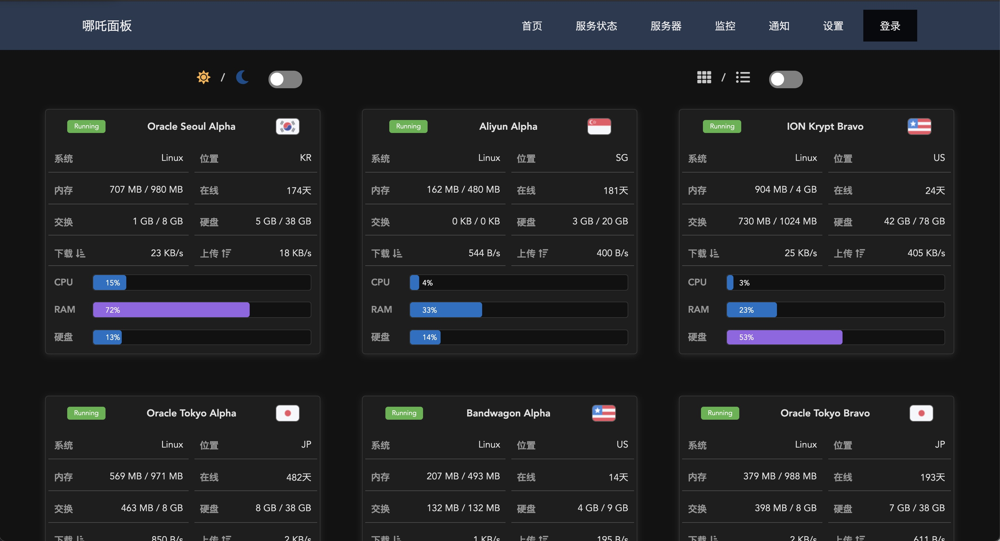

<div align="center">
  <br>
  
  <br>
  <small><i>LOGO designed by <a href="https://xio.ng" target="_blank">熊大</a> .</i></small>
  <br><br>
&nbsp;&nbsp;&nbsp;
  <br>
  <br>
  <p>:trollface: <b>哪吒监控</b> 一站式轻监控轻运维系统。支持系统状态、HTTP(SSL 证书变更、即将到期、到期)、TCP、Ping 监控报警，计划任务和在线终端。</p>
</div>

\>> QQ 交流群：872069346 **加群要求：已搭建好哪吒监控 & 有 2+ 服务器**

\>> [我们的用户](https://www.google.com/search?q="powered+by+哪吒监控"&filter=0) (Google)

| 默认主题                                                                                 | DayNight [@JackieSung](https://github.com/JackieSung4ev)     | hotaru                                                                     |
| ---------------------------------------------------------------------------------------- | ------------------------------------------------------------ | -------------------------------------------------------------------------- |
|                               |  |  |
| <div align="center"><b>默认主题魔改 <a href="https://ii.do/43.html">[教程]</a></b></div> |                                                              |                                                                            |
|        |                                                              |                                                                            |

## 安装脚本

**推荐配置：** 安装前准备 _两个域名_，一个可以 **接入 CDN** 作为 _公开访问_，比如 (status.nai.ba)；另外一个解析到面板服务器作为 Agent 连接 Dashboard 使用，**不能接入 CDN** 直接暴露面板主机 IP，比如（ip-to-dashboard.nai.ba）。

```shell
curl -L https://raw.githubusercontent.com/naiba/nezha/master/script/install.sh  -o nezha.sh && chmod +x nezha.sh
sudo ./nezha.sh
```

国内镜像加速：

```shell
curl -L https://cdn.jsdelivr.net/gh/naiba/nezha@master/script/install.sh -o nezha.sh && chmod +x nezha.sh
CN=true sudo ./nezha.sh
```

_\* 使用 WatchTower 可以自动更新面板，Windows 终端可以使用 nssm 配置自启动（见尾部教程）_

### 增强配置

通过执行 `./nezha-agent --help` 查看支持的参数，如果你使用一键脚本，可以编辑 `/etc/systemd/system/nezha-agent.service`，在 `ExecStart=` 这一行的末尾加上

- `--report-delay` 系统信息上报的间隔，默认为 1 秒，可以设置为 3 来进一步降低 agent 端系统资源占用（配置区间 1-4）
- `--skip-conn` 不监控连接数，机场/连接密集型机器推荐设置，不然比较占 CPU([shirou/gopsutil/issues#220](https://github.com/shirou/gopsutil/issues/220))
- `--skip-procs` 不监控进程数，也可以降低 agent 占用
- `--disable-auto-update` 禁止 **自动更新** Agent（安全特性）
- `--disable-force-update` 禁止 **强制更新** Agent（安全特性）
- `--disable-command-execute` 禁止在 Agent 机器上执行定时任务、打开在线终端（安全特性）
- `--tls` 启用SSL/TLS加密（使用 nginx 反向代理 Agent 的 grpc 连接，并且 nginx 开启 SSL/TLS 时，需要启用该项配置）

## 功能说明

<details>
    <summary>计划任务：备份脚本、服务重启，等定期运维任务。</summary>

使用此功能可以定期结合 restic、rclone 给服务器备份，或者定期某项重启服务来重置网络连接。

</details>

<details>
    <summary>报警通知：负载、CPU、内存、硬盘、带宽、流量、月流量、进程数、连接数实时监控。</summary>

#### 灵活通知方式

`#NEZHA#` 是面板消息占位符，面板触发通知时会自动替换占位符到实际消息

Body 内容是`JSON` 格式的：**当请求类型为 FORM 时**，值为 `key:value` 的形式，`value` 里面可放置占位符，通知时会自动替换。**当请求类型为 JSON 时** 只会简进行字符串替换后直接提交到`URL`。

URL 里面也可放置占位符，请求时会进行简单的字符串替换。

参考下方的示例，非常灵活。

1. 添加通知方式

   - server 酱示例

     - 名称：server 酱
     - URL：<https://sc.ftqq.com/SCUrandomkeys.send?text=#NEZHA>#
     - 请求方式: GET
     - 请求类型: 默认
     - Body: 空

   - wxpusher 示例，需要关注你的应用

     - 名称: wxpusher
     - URL：<http://wxpusher.zjiecode.com/api/send/message>
     - 请求方式: POST
     - 请求类型: JSON
     - Body: `{"appToken":"你的appToken","topicIds":[],"content":"#NEZHA#","contentType":"1","uids":["你的uid"]}`

   - telegram 示例 [@haitau](https://github.com/haitau) 贡献

     - 名称：telegram 机器人消息通知
     - URL：<https://api.telegram.org/botXXXXXX/sendMessage?chat_id=YYYYYY&text=#NEZHA>#
     - 请求方式: GET
     - 请求类型: 默认
     - Body: 空
     - URL 参数获取说明：botXXXXXX 中的 XXXXXX 是在 telegram 中关注官方 @Botfather ，输入/newbot ，创建新的机器人（bot）时，会提供的 token（在提示 Use this token to access the HTTP API:后面一行）这里 'bot' 三个字母不可少。创建 bot 后，需要先在 telegram 中与 BOT 进行对话（随便发个消息），然后才可用 API 发送消息。YYYYYY 是 telegram 用户的数字 ID。与机器人@userinfobot 对话可获得。

2. 添加一个离线报警

   - 名称：离线通知
   - 规则：`[{"Type":"offline","Duration":10}]`
   - 启用：√

3. 添加一个监控 CPU 持续 10s 超过 50% **且** 内存持续 20s 占用低于 20% 的报警

   - 名称：CPU+内存
   - 规则：`[{"Type":"cpu","Min":0,"Max":50,"Duration":10},{"Type":"memory","Min":20,"Max":0,"Duration":20}]`
   - 启用：√

#### 报警规则说明

##### 基本规则

- type
  - `cpu`、`memory`、`swap`、`disk`
  - `net_in_speed` 入站网速、`net_out_speed` 出站网速、`net_all_speed` 双向网速、`transfer_in` 入站流量、`transfer_out` 出站流量、`transfer_all` 双向流量
  - `offline` 离线监控
  - `load1`、`load5`、`load15` 负载
  - `process_count` 进程数 _目前取线程数占用资源太多，暂时不支持_
  - `tcp_conn_count`、`udp_conn_count` 连接数
- duration：持续秒数，秒数内采样记录 30% 以上触发阈值才会报警（防数据插针）
- min/max
  - 流量、网速类数值 为字节（1KB=1024B，1MB = 1024\*1024B）
  - 内存、硬盘、CPU 为占用百分比
  - 离线监控无需设置
- cover `[{"type":"offline","duration":10, "cover":0, "ignore":{"5": true}}]`
  - `0` 监控所有，通过 `ignore` 忽略特定服务器
  - `1` 忽略所有，通过 `ignore` 监控特定服务器
- ignore: `{"1": true, "2":false}` 特定服务器，搭配 `cover` 使用

##### 特殊：任意周期流量报警

可以用作月流量报警

- type
  - transfer_in_cycle 周期内的入站流量
  - transfer_out_cycle 周期内的出站流量
  - transfer_all_cycle 周期内双向流量和
- cycle_start 周期开始日期（可以是你机器计费周期的开始日期）
- cycle_interval 小时（可以设为 1 月，30\*24）
- min/max、cover、ignore 参考基本规则配置
- 示例: 3 号机器的每月 15 号计费的出站月流量 1T 报警 `[{"type":"transfer_out_cycle","max":1000000000000,"cycle_start":"2021-07-15T08:00:00Z","cycle_interval":720,"cover":1,"ignore":{"3":true}}]`

</details>

<details>
    <summary>服务监控：HTTP、SSL证书、ping、TCP 端口等。</summary>

进入 `/monitor` 页面点击新建监控即可，表单下面有相关说明。

</details>

<details>
  <summary>自定义代码：改LOGO、改色调、加统计代码等。</summary>

- 默认主题更改进度条颜色示例

  ```
  <style>
  .ui.fine.progress> .bar {
      background-color: pink !important;
  }
  </style>
  ```

- DayNight 主题更改进度条颜色、修改页脚示例（来自 [@hyt-allen-xu](https://github.com/hyt-allen-xu)）

  ```
  <style>
  .ui.fine.progress> .progress-bar {
    background-color: #00a7d0 !important;
  }
  </style>
  <script>
  window.onload = function(){
  var footer=document.querySelector("div.footer-container")
  footer.innerHTML="©2021 你的名字 & Powered by 你的名字"
  footer.style.visibility="visible"
  }
  </script>
  ```

- 默认主题修改 LOGO、修改页脚示例（来自 [@iLay1678](https://github.com/iLay1678)）

  ```
  <style>
  .right.menu>a{
  visibility: hidden;
  }
  .footer .is-size-7{
  visibility: hidden;
  }
  .item img{
  visibility: hidden;
  }
  </style>
  <script>
  window.onload = function(){
  var avatar=document.querySelector(".item img")
  var footer=document.querySelector("div.is-size-7")
  footer.innerHTML="Powered by 你的名字"
  footer.style.visibility="visible"
  avatar.src="你的方形logo地址"
  avatar.style.visibility="visible"
  }
  </script>
  ```

- hotaru 主题更改背景图片示例

  ```
  <style>
  .hotaru-cover {
     background: url(https://s3.ax1x.com/2020/12/08/DzHv6A.jpg) center;
  }
  </style>
  ```

</details>

## 常见问题

<details>
    <summary>如何进行数据迁移、备份恢复？</summary>

1. 先使用一键脚本 `停止面板`
2. 打包 `/opt/nezha` 文件夹，到新环境相同位置
3. 使用一键脚本 `启动面板`

</details>

<details>
    <summary>Agent 启动/上线 问题自检流程</summary>

1. 直接执行 `/opt/nezha/agent/nezha-agent -s 面板IP或非CDN域名:面板RPC端口 -p Agent密钥 -d` 查看日志是否是 DNS、网络不佳导致超时（timeout） 问题。
2. `nc -v 域名/IP 面板RPC端口` 或者 `telnet 域名/IP 面板RPC端口` 检验是否是网络问题，检查本机与面板服务器出入站防火墙，如果单机无法判断可借助 <https://port.ping.pe/> 提供的端口检查工具进行检测。
3. 如果上面步骤检测正常，Agent 正常上线，尝试关闭 SELinux，[如何关闭 SELinux？](https://www.google.com/search?q=%E5%85%B3%E9%97%ADSELINUX)

</details>

<details>
    <summary>如何使 OpenWrt/LEDE 自启动？来自 @艾斯德斯</summary>

首先在 release 下载对应的二进制解压 tar.gz 包后放置到 `/root`，然后 `chmod +x /root/nezha-agent` 赋予执行权限，然后创建 `/etc/init.d/nezha-service`：

```shell
#!/bin/sh /etc/rc.common

START=99
USE_PROCD=1

start_service() {
 procd_open_instance
 procd_set_param command /root/nezha-agent -s 面板网址:接收端口 -p 唯一秘钥 -d
 procd_set_param respawn
 procd_close_instance
}

stop_service() {
    killall nezha-agent
}

restart() {
 stop
 sleep 2
 start
}
```

赋予执行权限 `chmod +x /etc/init.d/nezha-service` 然后启动服务 `/etc/init.d/nezha-service enable && /etc/init.d/nezha-service start`

</details>

<details>
    <summary>实时通道断开/在线终端连接失败</summary>

使用反向代理时需要针对 `/ws`,`/terminal` 路径的 WebSocket 进行特别配置以支持实时更新服务器状态和 **WebSSH**。

- Nginx(宝塔)：在你的 nginx 配置文件中加入以下代码

  ```nginx
  server{

      #原有的一些配置
      #server_name blablabla...

      location ~ ^/(ws|terminal/.+)$  {
          proxy_pass http://ip:站点访问端口;
          proxy_set_header Upgrade $http_upgrade;
          proxy_set_header Connection "Upgrade";
          proxy_set_header Host $host;
      }

      #其他的 location blablabla...
  }
  ```

  如果非宝塔，还要在 `server{}` 中添加上这一段

  ```nginx
  location / {
    proxy_pass http://ip:站点访问端口;
    proxy_set_header Host $host;
  }
  ```

- CaddyServer v1（v2 无需特别配置）

  ```Caddyfile
  proxy /ws http://ip:8008 {
      websocket
  }
  proxy /terminal/* http://ip:8008 {
      websocket
  }
  ```

</details>

<details>
    <summary>Agent 连接 Dashboard 域名开启 Cloudflare CDN</summary>
根据 Cloudflare gRPC 的要求：gRPC 服务必须侦听 443 端口 且必须支持 TLS 和 HTTP/2。我们可以使用 nginx 反向代理 gRPC 并配置 SSL/TLS 证书。

- nginx 配置，比如 Agent 连接 Dashboard 的域名为 ip-to-dashboard.nai.ba，为 nginx 添加如下配置，然后重新启动 nginx 或者重新加载配置文件。
```nginx
server {
    listen 443 ssl http2;
    listen [::]:443 ssl http2;
    server_name ip-to-dashboard.nai.ba; # 你的 Agent 连接 Dashboard 的域名

    ssl_certificate          /data/letsencrypt/fullchain.pem; # 你的域名证书路径
    ssl_certificate_key      /data/letsencrypt/key.pem;       # 你的域名私钥路径

    underscores_in_headers on;

    location / {
        grpc_pass grpc://localhost:5555;
    }
}
```
- Agent 端配置，编辑 `/etc/systemd/system/nezha-agent.service`，在 `ExecStart=` 这一行的末尾加上 `--tls`，然后重启 nezha-agent.service。例如：
```bash
ExecStart=/opt/nezha/agent/nezha-agent -s ip-to-dashboard.nai.ba:443 -p xxxxxx --tls
```
- 在 Cloudflare 中将对应的域名解析设置橙色云开启CDN，并在网络选项中启用gRPC。
</details>

## 社区文章

- [哪吒探针 - Windows 客户端安装](https://nyko.me/2020/12/13/nezha-windows-client.html)
- [哪吒监控，一个便携服务器状态监控面板搭建教程，不想拥有一个自己的探针吗？](https://haoduck.com/644.html)
- [哪吒监控：小鸡们的最佳探针](https://www.zhujizixun.com/2843.html) _（已过时）_
- [>>更多教程](https://www.google.com/search?q="哪吒监控"+"教程") (Google)

SEO **云探针、多服务器探针、云监控、多服务器云监控**
